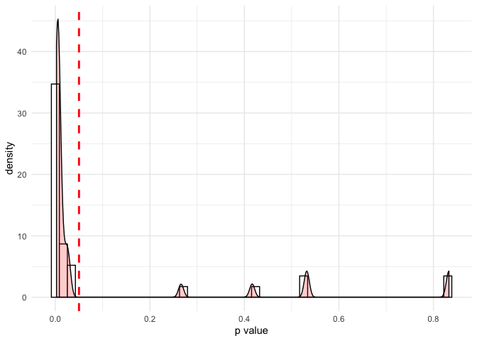

<!-- README.md is generated from README.Rmd. Please edit that file -->

<!-- badges: start -->

[](https://travis-ci.org/AngelosPsy/multifear)
[](https://www.tidyverse.org/lifecycle/#experimental)
[](https://codecov.io/gh/AngelosPsy/multifear)
[](https://CRAN.R-project.org/package=multifear)
[](https://github.com/AngelosPsy/multifear/actions)
<!-- badges: end -->

# Multifear

Multifear is an R package designed to perform multiverse analyses for
human conditioning data. **The package is currently under heavy
development and its features change often. You can give the package for
a spin but please do not use it yet for any publication as there is much
more work to be done.**

## Installing and loading the package

``` r
# Install devtools package in case it is not yet installed
install.packages("devtools") 
devtools::install_github("AngelosPsy/multifear")
```

The package can be loaded with the following package

``` r
library(multifear)
```

## Basic Example

We will start with a basic example of how the package works. Before
doing that, let’s load some additional packages that we need for our
example.

``` r
suppressPackageStartupMessages(library(dplyr))
suppressPackageStartupMessages(library(ggplot2))
```

Now we will use some simulated data set that are included as example
data in the package. In principle, you can use any data including
conditioned responses (e.g., skin conductance). You can load the
simulated data in your workspace as follows:

``` r
data("example_data")
```

Here are the first 6 rows of the data set

``` r
head(example_data, 6)
#>   id      CSP1      CSP2       CSP3      CSP4      CSP5      CSP6      CSP7
#> 1  2 0.6290557 0.9298822  1.0415000 0.9330014 0.9743682 0.8855119 0.8418664
#> 2  3 7.0795340 4.9765650 12.7791100 8.2847610 4.9798520 8.8685450 8.2468480
#> 3  4 0.0000000 1.2156950  2.4367400 4.5100300 5.3372170 4.6831920 3.6484020
#> 4  5 1.4378680 0.9705585  0.3784756 1.4434960 0.4060977 1.6015840 1.5274500
#> 5  7 0.9454062 3.2935940  3.4376340 2.7078930 3.6439630 3.8878390 3.6174920
#> 6  8 3.2373590 2.3439360  2.3931960 2.2908990 1.9583950 2.5094320 2.4234050
#>        CSP8      CSP9     CSP10       CSM1     CSM2      CSM3      CSM4
#> 1 0.9821523 0.5790559 0.3824215  0.9857365 1.267399 0.0000000 0.6403125
#> 2 0.7607041 1.7655060 2.1758810 13.6548600 0.906607 0.0000000 2.9130630
#> 3 2.1018580 6.4756940 2.6422620  0.0000000 3.238002 2.4289650 0.2526294
#> 4 1.1900760 0.3994079 0.6168466  1.3146440 0.000000 0.6570014 1.3710840
#> 5 2.2854040 5.2819210 4.5153330  4.2762160 3.196211 3.4280200 1.8877270
#> 6 2.7189870 3.7545760 0.5508313  2.7552620 2.284332 0.1147742 0.4229828
#>         CSM5       CSM6      CSM7      CSM8      CSM9     CSM10 group
#> 1 0.05137117 0.03480838 0.0000000 0.0000000 0.2903607 0.3149624     1
#> 2 0.60658980 3.72999700 1.1069910 3.6370250 0.0000000 0.0000000     2
#> 3 0.00000000 2.51429900 0.0000000 0.1862106 0.5207676 0.9575123     1
#> 4 0.53106310 0.54313130 0.2875019 0.0000000 0.1879596 0.1872537     2
#> 5 3.06479700 2.91668000 2.7914400 1.2298430 3.3771630 2.7057010     1
#> 6 2.22446600 0.00000000 0.0000000 1.2159860 0.0000000 0.0000000     2
```

A bit of explanation of the column names. With the column name ‘id’ is
the participant number. Columns that contain the conditioned responses
for conditioned stimulus plus (CS+) are denoted with column names
starting with ‘CSP’. The number next to this name (1, 2, …, 10) is the
trial number. The same goes for columns starting with ‘CSM’ but this
denotes conditioned responses in CS- trials. At this point the package
only supports a single CS+ and a single CS-. Also, the package assumes
that trials are following each – so trial 2 comes after trial 1 etc.
Let’s see the data:

``` r
datmelt <- example_data %>%
  select(-id) %>%
  colMeans() %>%
  reshape2::melt(dat) %>%
  mutate(variable = rownames(.)) %>%
  mutate(cs = stringr::str_sub(variable, 1, 3),
  time = stringr::str_sub(variable, 4, 5))
  
  ggplot(data = datmelt, aes(x = time, y = value, group = cs)) +
  geom_line(aes(linetype = cs)) +
  geom_point(aes(shape = cs))
```

<!-- -->

We see the basic learning pattern where CS+ responses end up being
higher than CS- responses. The deep in CS+ on trial 2 is in line with
the original data set.

Now we need to analyse the data. For this we will use the
*multifear::universe\_cs* function. In order for this function to work,
we need to provide the following arguments.

  - CS1: This will be the column names that contain the conditioned
    responses for the CS+ (i.e., CSP1 until CSP10).

  - CS2: This will be the column names that contain the conditioned
    response for the CS- (i.e., CSM1 until CSM10).

  - data: This is our data frame that contain that data for the CS+,
    CS-, as well as the column with the participant number.

  - group. In case of a group, then we need to specify the column with
    the group name. The default option is that there are no groups and
    we do not have any groups in our example.

  - phase. Here we define the conditioning phase that the data were
    collected in (e.g., acquisition phase, extinction phase, etc).
    Please note that in case the user has multiple phases, she/he needs
    to run the function separately for each phases.

There are some other options in the function, such as defining the type
of conditioning response. However, these are not necessary for now. So,
let’s now run the function

``` r
cs1 <- paste0("CSP", 1:10)
cs2 <- paste0("CSM", 1:10)
res <- multifear::universe_cs(cs1 = cs1, cs2 = cs2, data = example_data, 
                              subj = "id", group = NULL, phase = "acquisition", include_bayes = FALSE)
#> Registered S3 methods overwritten by 'lme4':
#>   method                          from
#>   cooks.distance.influence.merMod car 
#>   influence.merMod                car 
#>   dfbeta.influence.merMod         car 
#>   dfbetas.influence.merMod        car
```

And here are the results

``` r
res
#> # A tibble: 4 x 14
#>   x     y     exclusion model controls method p.value effect.size estimate
#>   <chr> <chr> <chr>     <chr> <lgl>    <chr>    <dbl>       <dbl>    <dbl>
#> 1 cs    scr   full data t-te… NA       t-test 1.24e-7      0.455     0.752
#> 2 cs    scr   full data t-te… NA       t-test 2.47e-7      0.455     0.752
#> 3 cs:t… scr   full data rep … NA       rep A… 3.70e-9      0.0247   NA    
#> 4 cs    scr   full data rep … NA       rep A… 2.47e-7      0.0863   NA    
#> # … with 5 more variables: statistic <dbl>, conf.low <dbl>, conf.high <dbl>,
#> #   framework <chr>, data_used <list>
```

Let’s go through each column separately

  - x : is the effect that you are testing. For example, the cs means
    that you are testing cs differences. cs:time the cs X time
    interaction is tested. Be careful: when testing interactions, we
    only report the highest order interaction. That means that if you
    have a cs x time interaction, you do not get the results of the cs
    or the time main effect.

  - y: the dependent variable. In the example this is the *scr*
    responses.

  - exclusion: This columns reports as to what data were included in the
    data set. For example, here you see that we have only full data sets
    – no exclusion. This is because the multifear::universe\_cs() only
    analyses full data sets. If we want to apply some exclusion
    criteria, we need to run the multifear::multiverse\_cs() function –
    see later on.

  - model: What model was used. For example, here we see t-tests, and
    rep ANOVA (which means repeated measures ANOVA).

  - controls: This column is left empty. I included it because the specs
    R package had it so we may need to use it later on.

  - method: The method is a combination of the *model* and *x* column.
    Not really necessary if the other two columns exist.

  - p.value: The p-value of the test

  - estimate: The estimate that is returned from the test. Keep in mind
    though that this applies only for the t-test at the moment. We need
    to see what we can do for the ANOVA,

  - statistic. The statistic of the test

  - conf.low and conf.high In case you have an estimate, this returns
    the low and high levels of it

  - framework were the data analysed within a NHST or Bayesian
    framework?

  - data\_used Here you have a data frame with the data used for the
    performed analyses. This is because someone maybe wants to recreate
    the results and also as a check that nothing went wrong.

So now let’s see how you can run the same analyses but after we apply
some selection criteria for non-learns. So, here it is

``` r
res_multi <- multifear::multiverse_cs(cs1 = cs1, cs2 = cs2, data = example_data, subj = "id", group = NULL, phase = "acquisition", include_bayes = FALSE)
res_multi
#> # A tibble: 60 x 16
#>    x     y     exclusion model controls method p.value effect.size estimate
#>    <chr> <chr> <chr>     <chr> <lgl>    <chr>    <dbl>       <dbl>    <dbl>
#>  1 cs    scr   full_data t-te… NA       t-test 1.24e-7      0.455     0.752
#>  2 cs    scr   full_data t-te… NA       t-test 2.47e-7      0.455     0.752
#>  3 cs:t… scr   full_data rep … NA       rep A… 3.70e-9      0.0247   NA    
#>  4 cs    scr   full_data rep … NA       rep A… 2.47e-7      0.0863   NA    
#>  5 cs    scr   last_tri… t-te… NA       t-test 1.07e-6      0.461     0.791
#>  6 cs    scr   last_tri… t-te… NA       t-test 2.13e-6      0.461     0.791
#>  7 cs:t… scr   last_tri… rep … NA       rep A… 8.19e-8      0.0251   NA    
#>  8 cs    scr   last_tri… rep … NA       rep A… 2.13e-6      0.0902   NA    
#>  9 cs    scr   last2_tr… t-te… NA       t-test 3.45e-5      0.432     0.756
#> 10 cs    scr   last2_tr… t-te… NA       t-test 6.91e-5      0.432     0.756
#> # … with 50 more rows, and 7 more variables: statistic <dbl>, conf.low <dbl>,
#> #   conf.high <dbl>, framework <chr>, data_used <list>, cutoff <dbl>,
#> #   name_cutoff <chr>
```

In terms of calling the function, we see that we need exactly the same
arguments as before. Internally, the function actually applies the
multifear::universe\_cs but now apart from the full data set, also for
the data sets that we have set some exclusion criteria. Whether each
line refers to the full data set or any of the exclusion criteria, we
can see on the column exclusion criteria or in the data\_used column,
although there it is difficult to see what happened and it serves only
reproduction criteria. So, the easiest thing to do is to see the
exclusion column. Now, it has the following levels:

``` r
res_multi$exclusion %>% unique()
#> [1] "full_data"        "last_trial"       "last2_trial"      "last_first_trial"
#> [5] "half_trials"
```

The exclusion criteria actually (largely) follow the criteria reported
in the eLife article (“Navigating the garden of forking paths for data
exclusions in fear conditioning research”; Lonsdorf et al., 2019). One
problem with the criteria is that of course you have different number of
trials, some studies exclude participants based on SCR but also on their
ratings, etc. This of course makes it difficult to *exactly* apply all
the criteria. To overcome this problem, we are going to form a summary
of exclusion criteria. So here we are:

1)  CS+/CS- differences for the last trial.

2)  CS+/CS- differences for the last two trials.

3)  CS+/CS- differences in the last half of the trials.

4)  CS+/CS- differences between the last and first trial.

The cutoff for these differences are defined as 0, 0.05, and 1. So, we
have every criterion, for every cutoff. So, what the function does is
actually internally first computing the differences in all the possible
combinations (i.e., last half of trials, differences in the last two
trials, etc) and also applies the different criteria (0.05, 0.1, 0).
Then, it repeats all the analyses performed in multifear::universe\_us()
function.

## Inferences

This is the most challenging part. For now you can use the following
function and you will get:

1)  A histogram will all the p value and a red line showing the
    significance limit – by default alpha = 0.05

2)  Mean p\_value

3)  the number of p values below the significance level

4)  Mean of Bayes factors.

<!-- end list -->

``` r
multifear::inference_cs(res_multi, na.rm = TRUE)
```

<!-- -->

    #>   mean_p_value prop_p_value
    #> 1 2.915891e-05          100
